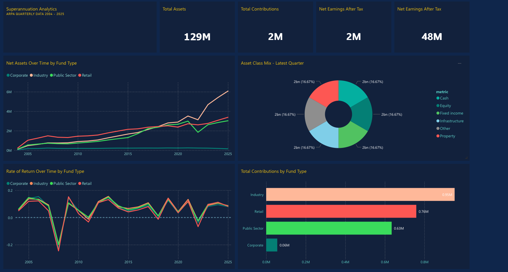
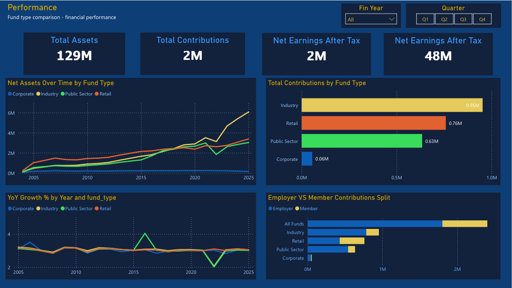
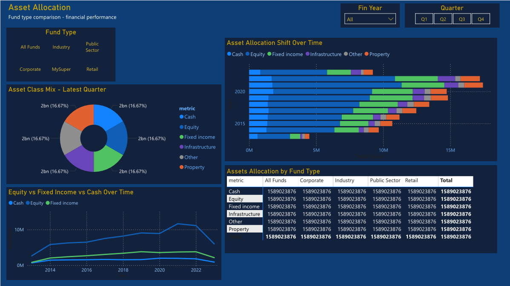
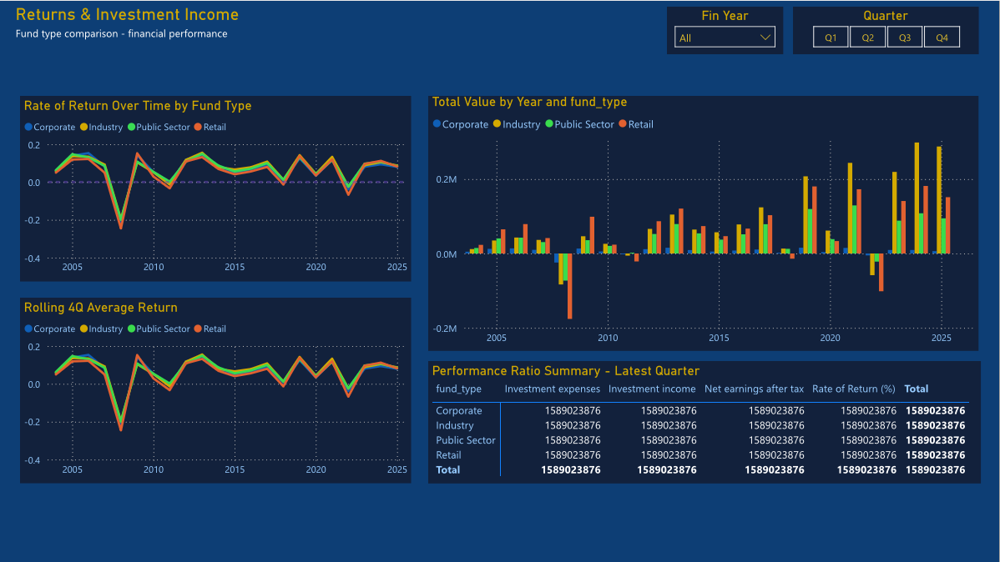

# Superannuation Analytics — End-to-End Data Project



## Project Overview
An end-to-end analytics project analysing 21 years of Australian 
superannuation data (2004–2025) published by APRA. The project covers 
the full data pipeline from raw Excel ingestion through SQL modelling 
to interactive Power BI dashboards.

## Tools & Technologies
| Tool | Purpose |
|---|---|
| Excel + Power Query | Data ingestion, cleaning, unpivoting |
| MySQL | Staging, schema design, star schema modelling |
| Power BI | Data modelling, DAX measures, dashboard |
| Power BI Service | Cloud publishing, sharing, auto-refresh |
| GitHub | Version control and portfolio showcase |

## Dataset
- **Source:** Australian Prudential Regulation Authority (APRA)
- **Coverage:** December 2004 to December 2025 (84 quarters)
- **Volume:** ~33,000 rows across 5 fund types and 4 table groups
- **Fund types:** Corporate, Industry, Public Sector, Retail, MySuper

## Project Architecture
```
APRA Raw Excel (27 sheets)
    ↓ Power Query — unpivot, clean, append, enrich
master_all (~33k rows, OneDrive)
    ↓ MySQL — staging table → star schema
fact_superannuation + 4 dimension tables
    ↓ Power BI Desktop — DAX, star schema model
3 Report Pages + 1 Summary Dashboard
    ↓ Power BI Service
Published & auto-refreshing dashboard
```

## Dashboard Pages
### Page 1 — Fund Type Performance Comparison
- KPI cards: total assets, contributions, net earnings, rolling return
- Net assets growth over time by fund type (2004–2025)
- Total contributions comparison across fund types
- YoY asset growth % trend with zero-growth reference line
- Employer vs member contribution split stacked bar

### Page 2 — Asset Allocation Breakdown
- Asset class mix donut chart (latest quarter)
- Asset allocation shift over time (100% stacked bar since 2013)
- Equity vs fixed income vs cash trend line
- Asset allocation matrix by fund type with conditional formatting

### Page 3 — Returns & Investment Income
- Rate of return over time with GFC and COVID reference lines
- Investment income by fund type per financial year
- Rolling 4-quarter average return
- Performance ratio summary matrix with data bars

## Key SQL Concepts Demonstrated
- Staging table design for raw data ingestion
- Normalised star schema (1 fact + 4 dimension tables)
- `INSERT INTO ... SELECT` with multi-table JOIN
- `STR_TO_DATE` for date parsing
- Foreign key constraints and referential integrity

## Key Excel / Power Query Concepts Demonstrated
- Unpivoting wide format (84 quarter columns) to long format
- Reusable M function with parameters (`fn_LoadFundTable`)
- Appending 5+ queries into a single master table
- Australian financial year calculation logic
- Data type enforcement and null handling

## Key Power BI Concepts Demonstrated
- Star schema data model
- DAX measures: `SUM`, `CALCULATE`, `DIVIDE`, `AVERAGEX`, `DATESINPERIOD`
- Time intelligence: YoY growth, rolling averages
- Conditional formatting with gradient colour scales
- Reference lines for economic events (GFC, COVID)
- Cross-page consistent colour theme

## Screenshots
| Page 1 — Performance | Page 2 — Asset Allocation |
|---|---|
|  |  |

| Page 3 — Returns | Dashboard Overview |
|---|---|
|  |  |
